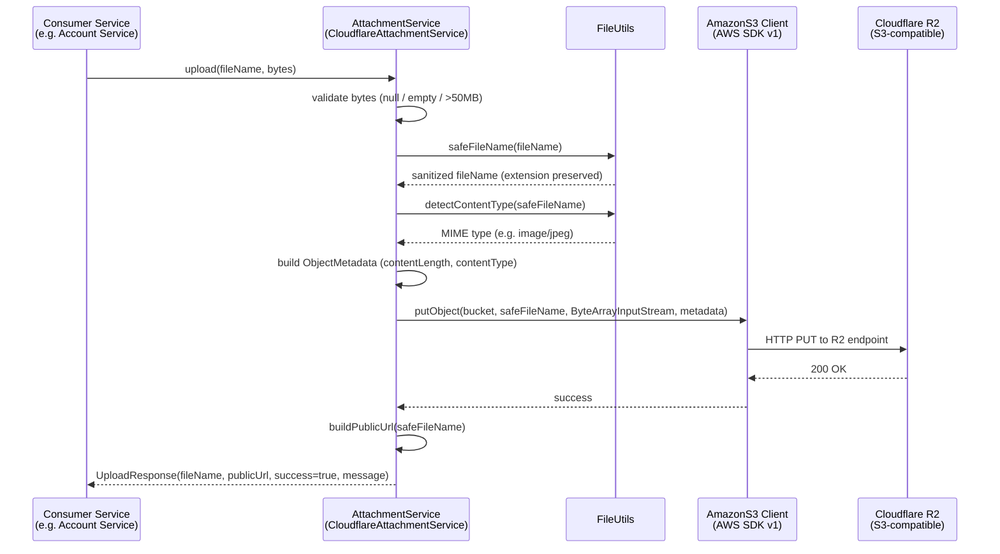
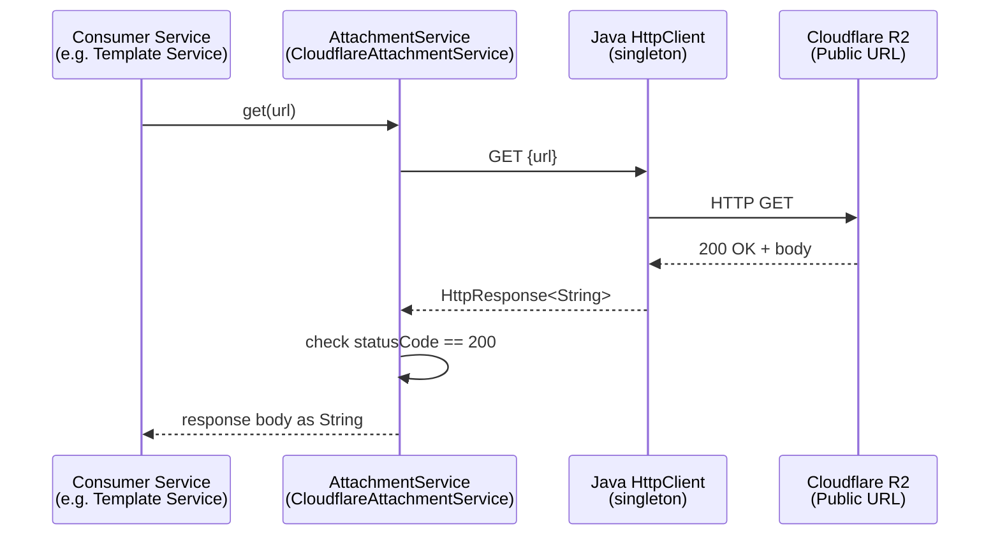

# Upload Engine SDK — Business-Facing Confluence Documentation

---

## Document Control

| Field | Value |
|-------|-------|
| **Document Title** | Upload Engine SDK (attachment-engine-sdk) |
| **Purpose** | Provides a reusable, auto-configured Spring Boot SDK for uploading files to Cloudflare R2 object storage and fetching stored content by URL. |
| **Artifact / Module** | `com.itways.assistant:attachment-engine-sdk:0.0.1` |
| **Owner / Squad** | TBD |
| **Last Updated** | 2026-05-06 |
| **Source** | `itways-ai/upload-engine-sdk` — branch `main` |
| **Related Services** | Account Service (consumer — profile picture uploads), Template Service (consumer — template content fetch via `get()`), common-lib (peer SDK) |

---

## Overview

The Upload Engine SDK is a shared library — not a standalone service — that any Spring Boot microservice in the platform can embed to gain file upload and retrieval capabilities against Cloudflare R2 (S3-compatible object storage). It is activated by adding `@EnableAttachment` to the host application's main class, after which a fully configured `AttachmentService` bean is available for injection. Currently confirmed consumers are the Account Service (profile picture uploads) and the Template Service (fetching template content stored in R2). The SDK has no REST API of its own; all interaction is through the injected `AttachmentService` interface.

---

## Endpoints

This SDK exposes **no HTTP endpoints**. It is a library consumed programmatically via the `AttachmentService` interface. The two operations it provides are documented below as API operations rather than HTTP endpoints.

---

### Operation A — `upload(fileName, bytes)`

**Type:** Programmatic (Java method call)
**Interface:** `com.itways.assistant.attachment.service.AttachmentService`
**Primary consumers (from code):** Account Service (`AccountServiceImpl.updateProfilePicture`), any service needing to store binary content in R2.

---

#### Sequence Diagram — File Upload (Happy Path)



---

#### What It Does

1. The consumer passes the original file name and the file content as a byte array.
2. The SDK validates the input — rejects empty files and files larger than 50 MB.
3. The file name is sanitised: special characters are replaced with underscores, but the file extension (e.g. `.jpg`, `.png`) is preserved.
4. The MIME type is detected from the sanitised file name using the OS content-type probe, defaulting to `application/octet-stream` if detection fails.
5. The file is uploaded directly to the configured Cloudflare R2 bucket with the correct `Content-Type` metadata.
6. A public URL is constructed from the configured base URL and the sanitised file name, then returned to the consumer.

---

#### Behaviour & Edge Cases

| Scenario | Behaviour |
|----------|-----------|
| `bytes` is `null` or empty | Throws `IllegalArgumentException` — upload never attempted |
| File size > 50 MB | Throws `IllegalArgumentException` — upload never attempted |
| File name is `null` or blank | Generates a fallback name: `file_<timestamp>` |
| File name contains special characters or spaces | Sanitised — e.g. `profile photo.jpg` → `profile_photo.jpg` |
| File name has no extension | Entire name sanitised; no extension appended |
| R2 / network error | Throws `RuntimeException` with original cause preserved in stack trace |
| `publicBaseUrl` and `publicDomain` both missing | Throws `IllegalArgumentException` at URL-build step |
| `publicBaseUrl` present | Used as URL prefix (preferred over `publicDomain`) |
| `publicDomain` present without `https://` prefix | SDK prepends `https://` automatically |
| Authentication | No JWT or user-level auth — access control is the consumer's responsibility |
| Idempotency | Uploading the same `fileName` twice overwrites the existing object in R2 silently |

**Integrations used:** INT-001, INT-002

---

### Operation B — `get(url)`

**Type:** Programmatic (Java method call)
**Interface:** `com.itways.assistant.attachment.service.AttachmentService`
**Primary consumers (from code):** Template Service (fetching FreeMarker template content stored in R2 by public URL).

---

#### Sequence Diagram — Content Fetch (Happy Path)



---

#### What It Does

1. The consumer passes a full public URL pointing to a file stored in R2.
2. The SDK sends an HTTP GET request using a shared `HttpClient` instance (singleton — not created per call).
3. If the response status is 200, the body is returned as a `String`.
4. Any non-200 response or network error throws a `RuntimeException` with the original cause preserved.

---

#### Behaviour & Edge Cases

| Scenario | Behaviour |
|----------|-----------|
| HTTP 200 | Returns response body as `String` |
| HTTP non-200 (e.g. 403, 404) | Throws `RuntimeException("Failed to fetch content from storage: ...")` |
| Network timeout / DNS failure | Throws `RuntimeException` with original cause |
| Binary content (images, PDFs) | Returns raw bytes as a `String` — only suitable for text-based content (templates, JSON). Binary use is not supported. |
| Authentication on R2 URL | No auth headers added — URL must be publicly accessible |

**Integrations used:** INT-002

---

## Integration Mapping

| ID | Name | Type | Direction | Purpose | Notable Config Keys |
|----|------|------|-----------|---------|---------------------|
| INT-001 | Cloudflare R2 — S3 API (write path) | HTTP/S3 (AWS SDK v1) | Outbound | Uploads file bytes to the configured R2 bucket with correct metadata | `cloudflare.r2.account-id`, `cloudflare.r2.access-key`, `cloudflare.r2.secret-key`, `cloudflare.r2.bucket` |
| INT-002 | Cloudflare R2 — Public URL (read path) | HTTP (Java HttpClient) | Outbound | Fetches stored file content by public URL (used by `get()` operation and to build upload response URLs) | `cloudflare.r2.public-base-url` (preferred), `cloudflare.r2.public-domain` (fallback) |

---

## Configuration Reference

All properties are bound under the `cloudflare.r2` prefix via `CloudFlareR2Config`.

| Property | Required | Description |
|----------|----------|-------------|
| `cloudflare.r2.account-id` | Yes | Cloudflare account ID — used to construct the R2 S3 endpoint URL |
| `cloudflare.r2.access-key` | Yes | R2 API access key |
| `cloudflare.r2.secret-key` | Yes | R2 API secret key |
| `cloudflare.r2.bucket` | Yes | Target R2 bucket name |
| `cloudflare.r2.public-base-url` | No* | Full public base URL (e.g. `https://cdn.example.com`) — preferred for URL construction |
| `cloudflare.r2.public-domain` | No* | Public domain only (e.g. `cdn.example.com`) — used if `public-base-url` is absent |

*At least one of `public-base-url` or `public-domain` must be set, or uploads will fail at URL-build time.

---

## Activation

Add `@EnableAttachment` to the host service's main application class:

```java
@SpringBootApplication
@EnableAttachment
public class MyServiceApplication { }
```

Spring Boot auto-configuration (`AutoConfiguration.imports`) is also registered, so the SDK will activate automatically if it is on the classpath without the annotation — however, explicit `@EnableAttachment` is recommended for clarity.

---

## Open Questions / Gaps

- **Binary content via `get()`:** The method returns `String`. Fetching binary files (images, PDFs) will produce garbled output. If any consumer needs to fetch binary content, the interface needs a `byte[] getBytes(String url)` overload.
- **No folder/path support in `upload()`:** The README documents folder organisation as a feature, but the `upload(fileName, bytes)` signature has no `folder` parameter. Files are always uploaded to the bucket root. The interface needs a `upload(folder, fileName, bytes)` overload to support this.
- **AWS SDK v1:** The SDK uses `com.amazonaws:aws-java-sdk-s3:1.12.772` (maintenance-only). Migration to `software.amazon.awssdk:s3` (v2, latest `2.43.0`) is recommended for long-term support and async capability.
- **No upload deduplication / unique naming:** Uploading the same file name twice silently overwrites the existing object. If consumers need versioning or collision avoidance, a UUID prefix or timestamp strategy should be added.
- **50 MB hard limit is SDK-enforced only:** The limit in `upload()` is a code-level guard. Consumers must also configure `spring.servlet.multipart.max-file-size` and `spring.servlet.multipart.max-request-size` in their own `application.properties` to prevent Tomcat from rejecting the request before it reaches the SDK (confirmed issue in Account Service — fixed separately).
- **`get()` has no timeout configured:** The `HttpClient` singleton uses default JVM timeouts. A slow or unresponsive R2 endpoint will block the calling thread indefinitely. A `connectTimeout` and `requestTimeout` should be set on the `HttpClient` instance.
- **No tests:** Zero test coverage in the SDK. Unit tests for `safeFileName`, `detectContentType`, and the upload/fetch flows are needed before this is considered production-stable.
